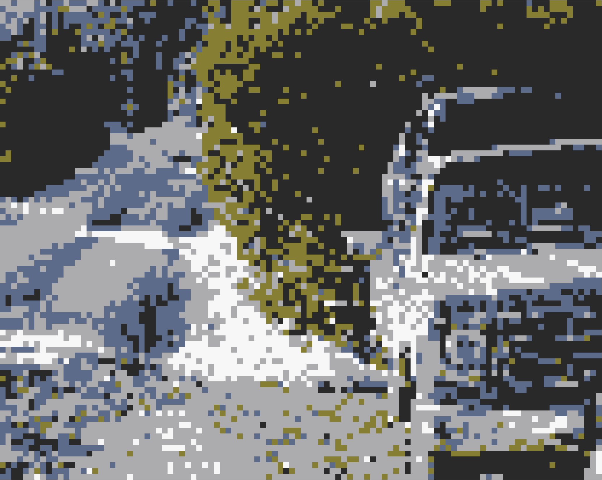

## hi i'm Albin

  

* currently i'm working on utilizing NumPy, SciPy, and Pandas in order to create regresions for computational analysis see more [here](https://github.com/WillZlog/MarketMadness)
* i'm learning CAD and 3d printing and including it with hardware, like in [this repo](https://github.com/WillZlog/MusicPi)
* my favorite and first language is python
* fun fact i watch and race cars in my free time, also i do photography

you can find me on:

[linkedin](www.linkedin.com/in/william-albin-zieme-821a24319)
[leetcode](https://leetcode.com/u/gEHoPpx1hp/)
[hackerrank](https://www.hackerrank.com/profile/albin_zieme)
